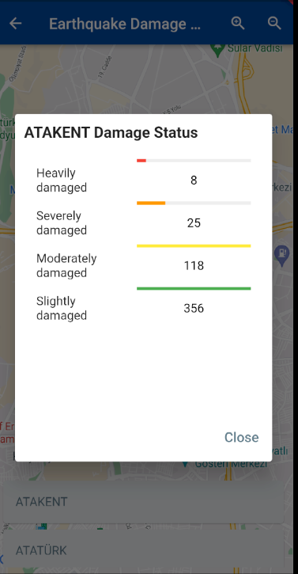

# GCMA - Turkiyer v1.1.1.29

 Global Crisis Management Application

  

    <h2>Screenshots and codes of the application //  </h2>
   
This application is designed as part of the predictive model DPM.

   
You can find the instructions below for running the application

  

  

   <h3>Administrator Screen</h3>
    
water destinations, critical areas, earthquake damage map, regional damage map, user authorization area, etc. You can access the screens from this screen.

     
  

 
  

  

   <h3>Some guidelines to get you started.</h3>
    
User records are kept on firebase, and user roles (admin, moderator and citizen) are also kept here. To run the application and start developing it, you first need to create a firebase configuration. If you fail in these steps, you can send an e-mail to this address: oguz.kayant@gmail.com

   
  

   
  

   <h3>damage map</h3>
   
regional damage data

    
  

  

   <h3>damage map</h3>
   
regional damage list data 

    
  

  
 

  <h3>Login Screen</h3>
 
    

 

  <h3>Register Screen </h3>
    

 

  <h3>code screens</h3>
  
User Rules Code

    

 

  <h3>detailed earthquake data</h3>
  
By visualizing the earthquakes that have occurred, it retrieves the earthquake information from the USGS APIs and lists them. Sizes can be customized

    

 

  <h3>detailed earthquake data</h3>
  
By visualizing the earthquakes that have occurred, it retrieves the earthquake information from the USGS APIs and lists them. Sizes can be customized

    

 

  <h3>IBB air quality API</h3>
  
This screen is used to capture and visualize the air quality in the region by using the APIs of the open data platform, which is a project of the Istanbul Metropolitan Municipality IT Department.

    

 

  <h3>detailed earthquake data</h3>
  
By visualizing the earthquakes that have occurred, it retrieves the earthquake information from the USGS APIs and lists them. Sizes can be customized

    

